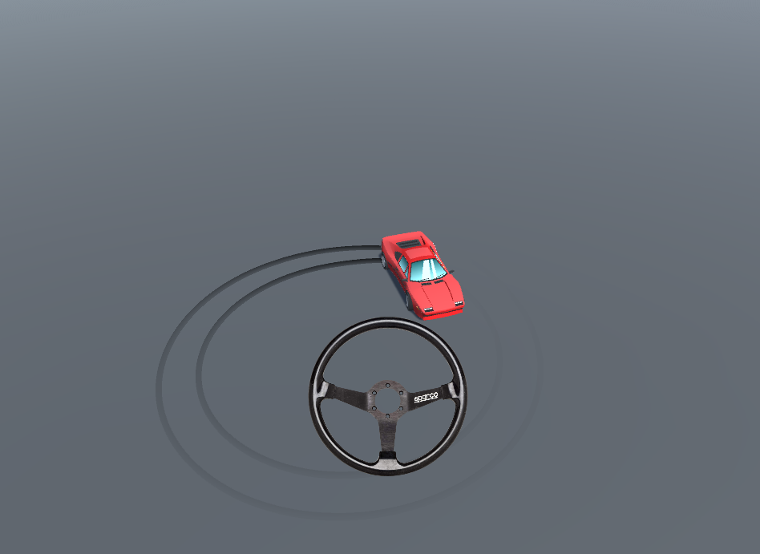
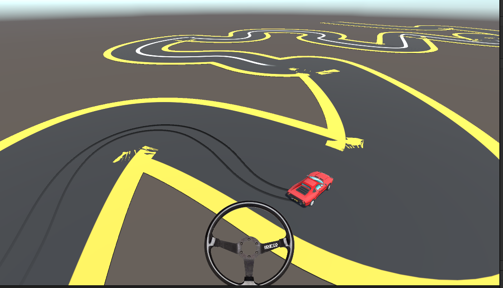

# HyperDrift Demo
I tried to clone Hyper/drift mechanic.

I also add some features like wheel trails , wheel visual rotation  and steering wheel control for turning. 

## Controls:
- **Gas**: W or S
- **Turn** : A-D or Steering Wheel
- **Reset Car ** : R 
- **Change Camera ** : F

## Unity Version
- 2021.3.3f1

## Preview

  
  

</p

## Assets

Car asset = [SHADED: FREE Retro Car](https://assetstore.unity.com/packages/3d/vehicles/land/shaded-free-retro-car-179873).

